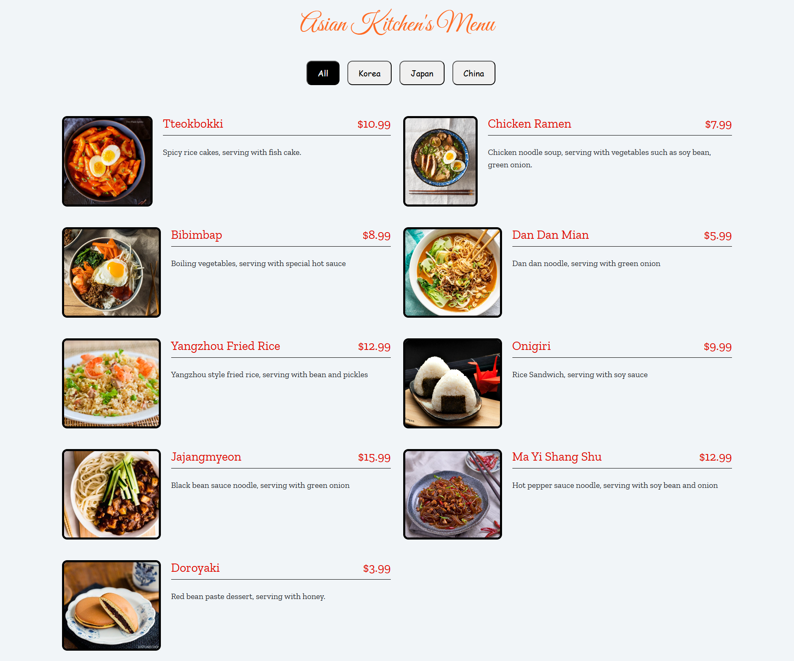
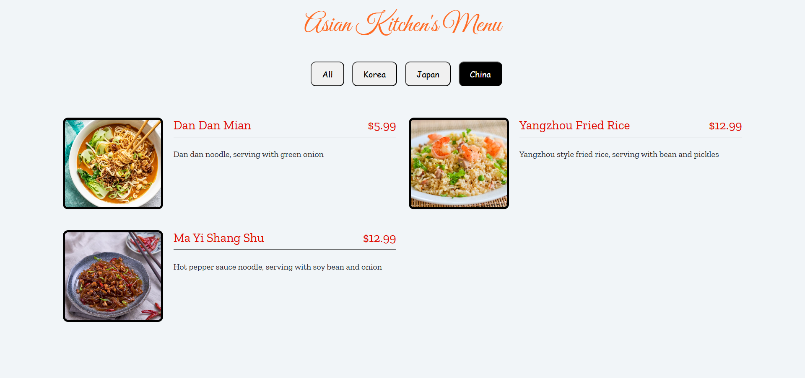

# :closed_book: Asian Kitchen's Menu

[🇹🇷 Click for Turkish README](./README.tr.md)

*Created on: March 18, 2025*

* This project was created as **Week-6 / Assignment-2 / Menu** for the Patika Frontend Bootcamp.
* Developed as a practice project for **JavaScript** and dynamic web applications.
* Built with **HTML**, **CSS**, **Bootstrap 4**, and **JavaScript**.
* Features and logic are inspired by [this example project](https://ayerdelen.github.io/AsianKitchen/).

---

## 🌐 Live Demo

Visit the live website : [Asian Kitchen's Menu](https://asian-kitchen-s-menu.vercel.app/)


---

## :computer: Installation and Usage

1. Clone the project:
```bash
git clone https://github.com/tunahanyasar/asian-kitchen-s-menu.git
```
2. Navigate to the project directory:
```bash
cd asian-kitchen-menu
```
3. Open `index.html` in a web browser.

---

## 📜 Project Structure

:open_file_folder: **Folders;**
* `index.html` - Main page
* `style.css` - Custom stylesheet
* `app.js` - JavaScript logic
* `img/` - Menu images
* `img-page/` - Screenshots for the README

### Main Features
- **Category Buttons:** Filter menu items by category (All, Korea, Japan, China)
- **Dynamic Rendering:** All buttons and menu items are created with JavaScript
- **Responsive and modern UI with Bootstrap 4**

---

## :star2: Key Features

- Filter menu items by category with a single click
- All UI elements are dynamically generated with JavaScript
- Responsive design for all devices

---

## 💡 Technologies Used

**Frontend:**
* HTML5
* CSS3
* Bootstrap 4
* JavaScript (DOM, Functions, Array-Object, forEach)

---

## 🎯 Project Goals

1. **User Experience**
   - Easy and interactive menu filtering
   - Visually appealing and responsive menu layout
2. **Technical Achievements**
   - Practice with JavaScript DOM, events, and dynamic rendering
   - Custom styling with CSS and Bootstrap

---

## 📸 Screenshots

### All Menu Items


### Korea Menu Items


### Japan Menu Items


### China Menu Items


---

## 📞 Contact

[Tunahan Yaşar](https://github.com/tunahanyasar)

* GitHub: [@tunahanyasar](https://github.com/tunahanyasar)
* LinkedIn: [Tunahan Yaşar](https://www.linkedin.com/in/tunahan-yasar/)


