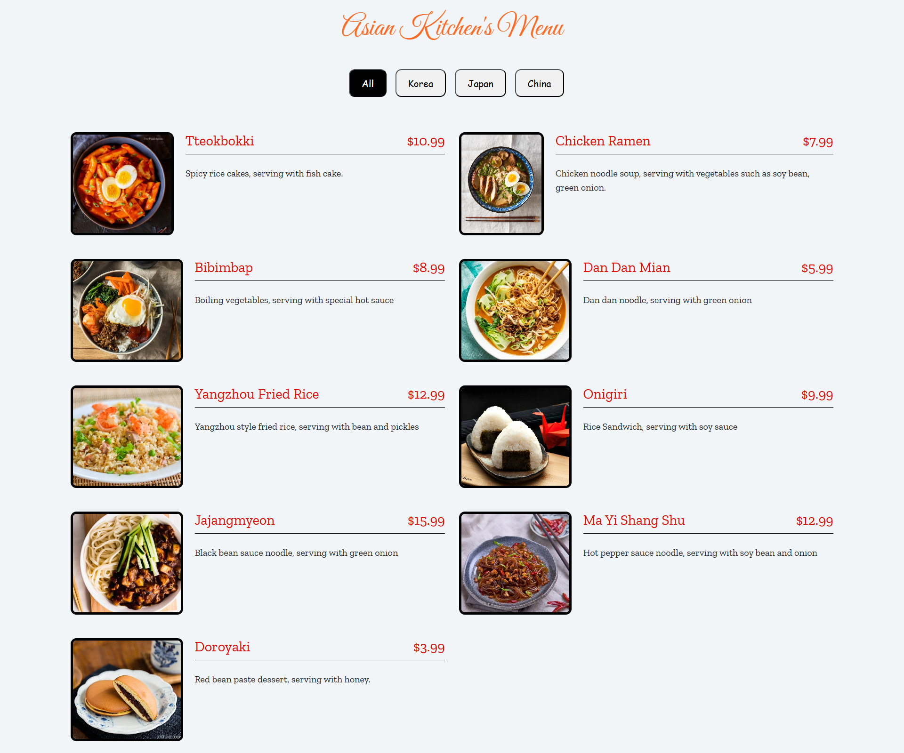
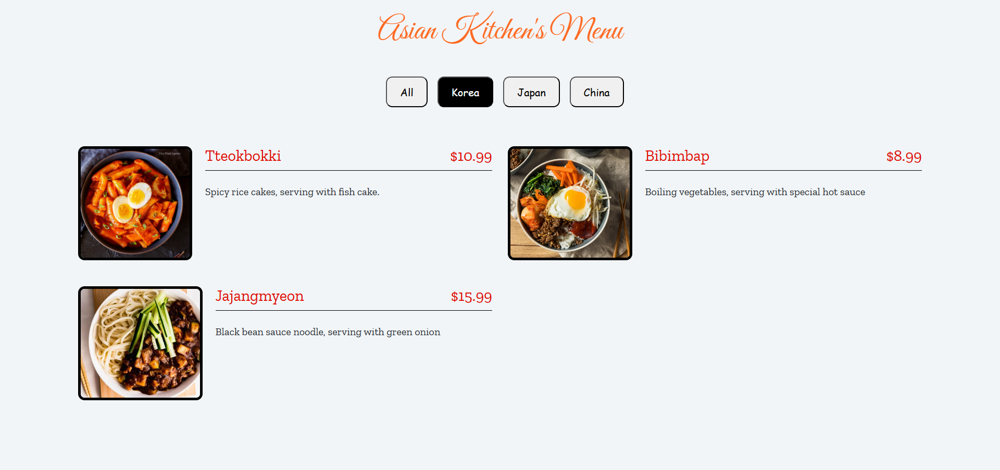
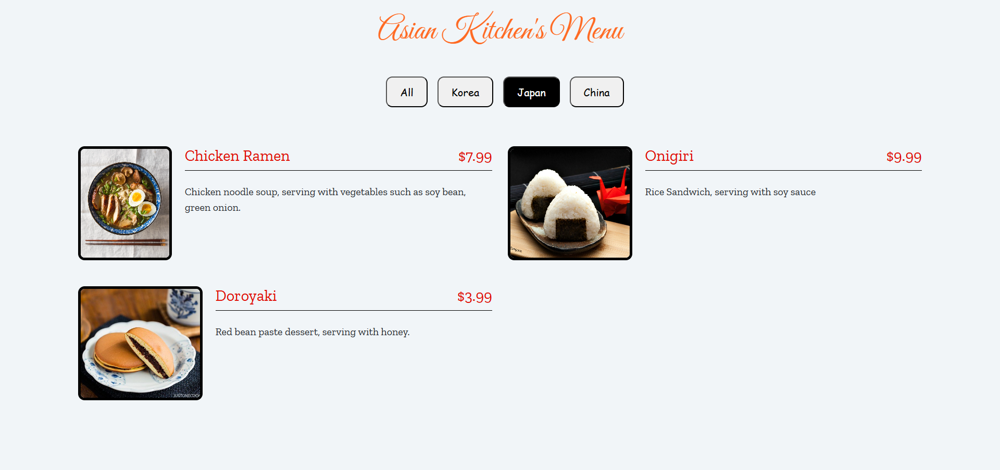
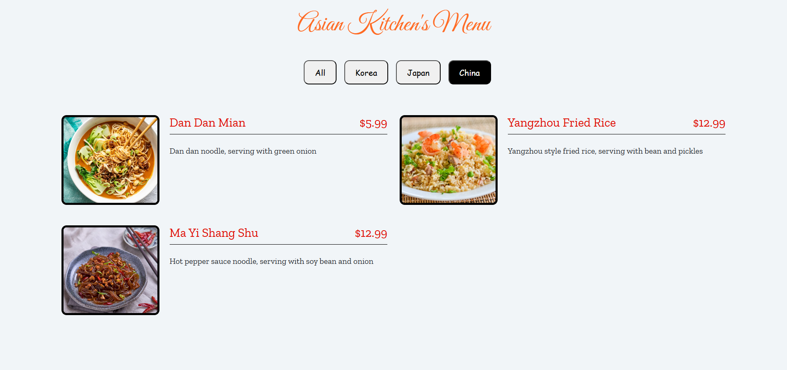

# :closed_book: Asian Kitchen's Menu

[🇬🇧 İngilizce README için tıklayın](./README.md)

*Oluşturulma Tarihi: 18 Mart 2025*

* Bu proje, Patika Frontend Bootcamp'i için oluşturulan **Hafta-6 / Ödev-2 / Menu** projesidir.
* **JavaScript** ve dinamik web uygulamaları için bir pratik projesidir.
* **HTML**, **CSS**, **Bootstrap 4** ve **JavaScript** kullanılarak geliştirilmiştir.
* Özellikler ve mantık, [bu örnek projeden](https://ayerdelen.github.io/AsianKitchen/) esinlenilmiştir.

---

## 🌐 Canlı Demo

> (Canlı demo linki ekleyebilirsiniz)

---

## :computer: Kurulum ve Kullanım

1. Projeyi klonlayın:
```bash
git clone https://github.com/tunahanyasar/asian-kitchens-menu.git
```
2. Proje dizinine gidin:
```bash
cd asian-kitchens-menu
```
3. `index.html` dosyasını bir web tarayıcısında açın.

---

## 📜 Sayfa Yapısı

:open_file_folder: **Klasörler;**
* `index.html` - Ana sayfa
* `style.css` - Özel stil dosyası
* `app.js` - JavaScript kodları
* `img/` - Menü görselleri
* `img-page/` - README için ekran görüntüleri

### Ana Özellikler
- **Kategori Butonları:** Menü elemanlarını kategoriye göre filtreleme (All, Korea, Japan, China)
- **Dinamik Oluşturma:** Tüm butonlar ve menü elemanları JavaScript ile oluşturuluyor
- **Bootstrap 4 ile modern ve responsive arayüz**

---

## :star2: Öne Çıkan Özellikler

- Tek tıkla kategoriye göre menü filtreleme
- Tüm arayüz elemanları JavaScript ile dinamik olarak oluşturuluyor
- Tüm cihazlar için responsive tasarım

---

## 💡 Kullanılan Teknolojiler

**Frontend:**
* HTML5
* CSS3
* Bootstrap 4
* JavaScript (DOM, Fonksiyonlar, Array-Object, forEach)

---

## 🎯 Proje Hedefleri

1. **Kullanıcı Deneyimi**
   - Kolay ve etkileşimli menü filtreleme
   - Görsel olarak hoş ve responsive menü düzeni
2. **Teknik Kazanımlar**
   - JavaScript DOM, event ve dinamik render pratiği
   - CSS ve Bootstrap ile özel stil uygulamaları

---

## 📸 Ekran Görüntüleri

### Tüm Menü Öğeleri


### Korea Menü Öğeleri


### Japan Menü Öğeleri


### China Menü Öğeleri


---

## 📞 İletişim

[Tunahan Yaşar](https://github.com/tunahanyasar)

* GitHub: [@tunahanyasar](https://github.com/tunahanyasar)
* LinkedIn: [Tunahan Yaşar](https://www.linkedin.com/in/tunahan-yasar/) 